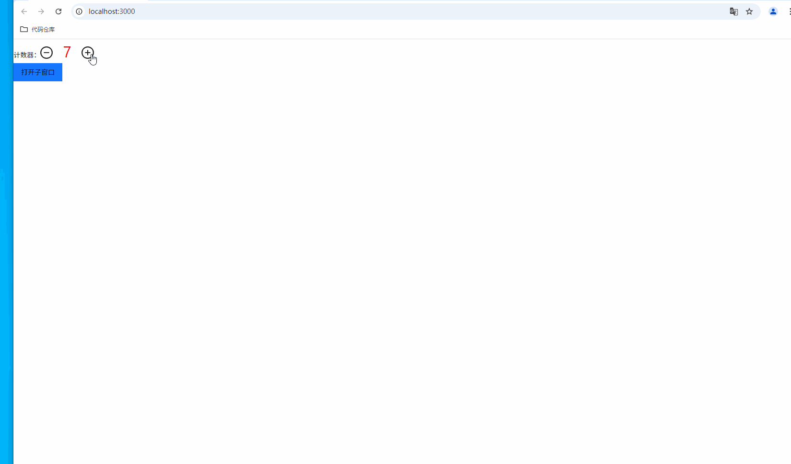
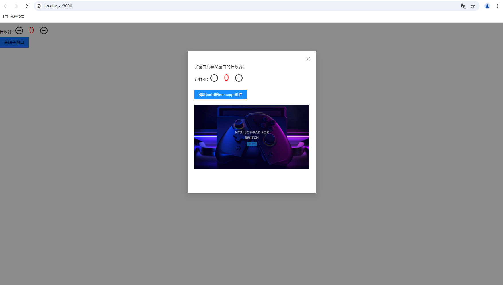
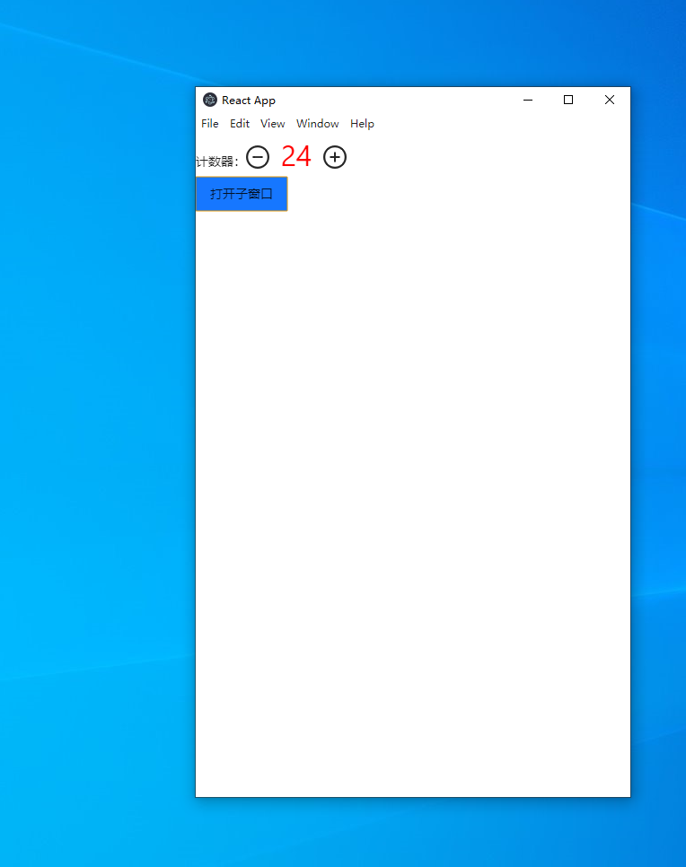
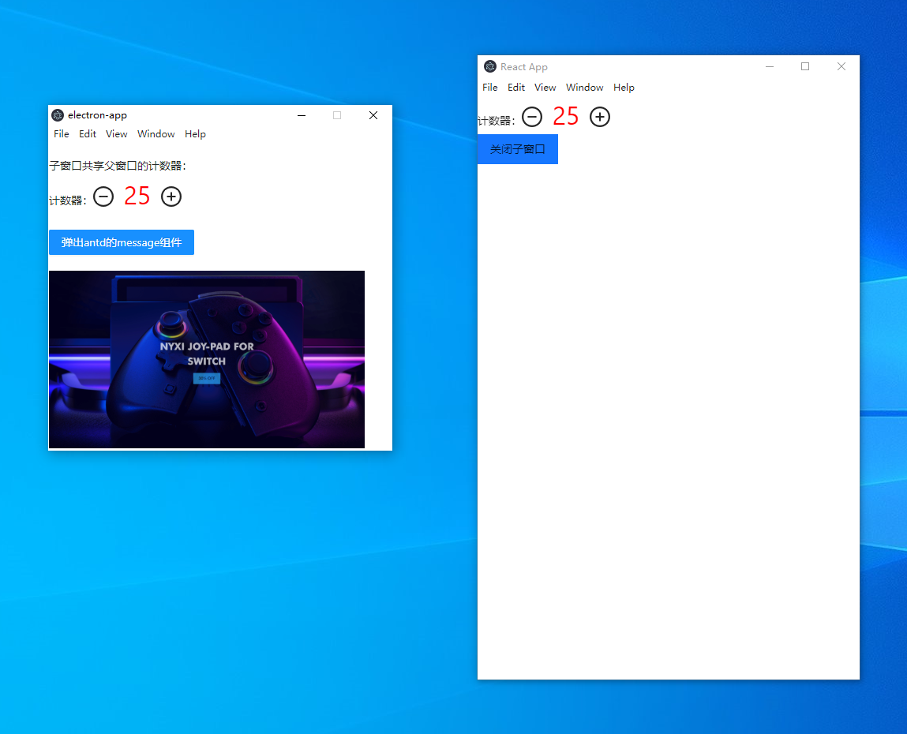

## 环境
- node：16 or >16

## 运行
- npm install
- npm run start
## 使用
- public/base.html。用简单的html验证浏览器原生支持window.open的特性
- public/改进.html。基于base.html的改进版，解决了关闭再打开子窗口时，点击事件失效的问题
- 如果需要体验window open的工程化应用，运行npm run start即可，同时需要结合[electron-app](https://github.com/lizuncong/electron-app/tree/share-demo)这个electron项目。记得需要确保两个项目都在share-demo分支

## Electron如何用本地资源的方式使用window open？
将src/router/index.js中的createBrowserRouter改成createHashRouter，然后将config/webpack.config.js中的output.publicPath改成'./'，然后执行npm run build即可。将生成的build目录下的静态资源复制到[electron-app](https://github.com/lizuncong/electron-app/tree/share-demo)中的src/window-open/build即可，详见Electron项目的readme

## 效果
在web端的效果如下，当在web端点击打开子窗口时，是以Modal的方式打开：

而在Electron客户端点击打开子窗口时，是以独立窗口的方式打开：

